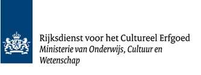

---
title: "Cultural Heritage ASessor (CHAS)"
---

<div style="text-align: center; margin-bottom: 20px;">
  
</div>


# CHAS Toolkit: Cultural Heritage ASsessor

**Author**: [Ruben Schalk](mailto:r.schalk@cultureelerfgoed.nl)  
**Affiliation**: [Rijksdienst voor het Cultureel Erfgoed](https://www.cultureelerfgoed.nl)  
**Date**: `r format(Sys.time())`

<style type="text/css">
  body{
  font-size: 14pt;
text-align: justify}
.table-wrapper {
  overflow-x: scroll;
}
h1:first-child {
    display: none;
  }
</style>


```{r message=FALSE, warning=FALSE, echo=FALSE}

library(jsonlite) 
library(rjson)
library(data.table)
library(httr)
library(curl)
library(stringi)

setwd("C:\\Users\\Ruben\\Documents\\05. RCE\\Europeana")

```

<a id="top"></a>

# Content
- [Background](#background)\
- [From CMS to csv](#from-cms-to-csv)\
- [From csv to linked data](#from-csv-to-linked-data)\
- [Overview of terms](#overview-of-terms)\
- [Connecting to thesauri and reference data](#connecting-to-thesauri-and-reference-data)\
   - [Cultural Heritage Thesaurus](#cultural-heritage-thesaurus)
   - [Colonial History thesaurus](#colonial-history-thesaurus)
   - [Geonames](#geonames)
   - [RKD Artists](#rkd-artists)


# Background
Many museums, libraries, archives and other cultural heritage institutions are currently working on digitally disclosing their collections. In The Netherlands, publishing these data in the [linked data format](https://netwerkdigitaalerfgoed.nl/activiteiten/linked-data-2/) is the format of choice . By using linked data, collections can be shared in an interoperable manner. But what is more important, when using linked data to its fullest connections can be made with other data, live on the web. In this way, paintings from a specific artist can be connected to another painting by the same artists in another museum, even when the first museum is unaware of its  existence. For users this is great: building applications on top of linked data collections allows them to discover related objects across institutions across the world.

Great as this sounds, publishing linked data and using its fullest potential comes with challenges. First, converting data from a collections management system to linked data is often not yet possible from within these applications. Second, and most importantly, linked data only becomes truly linked if the metadata uses URI's from publicly available thesauri or other term lists. For example, if museum A only denotes Van Gogh as `Gogh, Vincent van`, and museum B only uses `Vincent van Gogh`, no connection can be made between related objects. However, if both museums also provide a URI (more or less a URL) from a thesauri to describe Van Gogh - for instance https://data.rkd.nl/artists/32439 - then we can use this URI to 'travel' between objects of the same artist (and all related information) when the collection is published as linked data. The same goes for other key variables, such as materials, genres, categories, etc. Ideally, GLAMs should incorporate URI's from thesauri like the [Cultural Heritage Thesaurus](https://thesaurus.cultureelerfgoed.nl/), [curated bibliographies](http://data.bibliotheken.nl/doc/dataset/persons) or others to describe their objects. 

As long as publishing thesauri-enriched linked data is not yet the industry standard, GLAMs may benefit from tools, tips and tricks to help them get started. This is what we aim to do with the pipeline presented here. We have called it the Cultural Heritage ASsessor (or CHAS). Below we present a combination of scripts and templates, open-source tooling and public SPARQL queries that help GLAMs to:\

  * convert records to linked data;
  * evaluate how easily these records can be enriched with certain thesauri or other term list, such as contested terms in cultural heritage.

Together, these steps assist GLAMs to publish linked data, and connect this to public thesauri to make it more usable for others. In the remainder of this explanation we'll use two sample datasets to illustrate the process, provided by the [Dutch Cultural Heritage Agency (RCE)](https://www.cultureelerfgoed.nl/). In the future, we aim to make the pipeline as generic as possible and suitable to different data inputs. 

If you want to try out the scripts on your own collection data, read through the steps at the [CHAS repo]() and use the [CHAS_report file]().

# From CMS to csv [#](#top)
We start the pipeline with an export from a collections management system, which is a csv file in our example. Should you have an xml file, you can convert this to csv using software like Excel or Openrefine, or online converters like [convertio](https://convertio.co/). The choice to start from a csv is intentional: using a csv forces us to keep the datamodel as 'flat' as possible, which helps to maintain an easy overview of the data. This suits our purpose of assessing collection data. When 'officially' publishing collections as linked data it is likely that the datamodel becomes more layered to keep as much context and content as possible. 

The export sample csv contains several hundreds objects with a colonial connection from the [RCE Art Collection](https://www.collectienederland.nl/vc/rce-kunstcollectie/). In Excel or Openrefine we first select only the columns we want to keep. Many fields are not required for our exercise and only make the process more cumbersome. For example, our sample dataset originally has hundreds of (mostly empty) columns. We only keep those that have information that can be mapped to thesauri: material, subject, creator, technique and location. We delete the unwanted columns, rename the others to something we can understand, and save the edited csv. You can download the edited sample csv from the [CHAS repository](https://github.com/cultureelerfgoed/thesauri/tree/main/chas). The first rows now look  like this (without the column 'description'):

<div class="table-wrapper" markdown="block">

| priref | associated_subject_1 | associated_subject_2 | associated_subject_3 | associated_subject_4 | material_1 | material_2 | object_category | object_name    | object_number | creator_name   | production_place | acquisition_place | technique   |
|--------|----------------------|----------------------|----------------------|----------------------|------------|------------|----------------|----------------|---------------|----------------|-----------------|-------------------|-------------|
| 13279  | sculptuur           | beeldhouwkunst      | masker               | dier                 | hout       | verf       | ethnografica   | figuurplastiek | AB15389       | onbekend       | Kameroen        | Rotterdam         |             |
| 13281  | sculptuur           | beeldhouwkunst      | masker               | dier                 | hout       | touw       | ethnografica   | figuurplastiek | AB15390       | Igbo, Volk van | Kameroen        | Rotterdam         |             |
| 13282  | sculptuur           | beeldhouwkunst      | vrouwen              |                      | hout       | verf       | ethnografica   | figuurplastiek | AB15391       | Senufo, Volk van | Ivoorkust       | Rotterdam         | gepatineerd |
| 13284  | sculptuur           | beeldhouwkunst      | mannen               | masker               | staal      | hout       | ethnografica   | figuurplastiek | AB15393       | Igbo, Volk van | Nigeria         | Rotterdam         |             |
| 13285  | sculptuur           | beeldhouwkunst      | masker               |                      | hout       | mensenhaar | ethnografica   | figuurplastiek | AB15394       | Beneden-Sepik, Volk van | Papoea-Nieuw-Guinea | Rotterdam         |             |
| 13333  | sculptuur           | beeldhouwkunst      | fragment             | archeologica          | aardewerk  | pigment    | ethnografica   | figuurplastiek | AB15425       | Teotihuacan, Volk van | Mexico          | Rotterdam         |             |

</div>
\

We have kept some identifier columns to allow merging of edits with the original records.

# From csv to linked data [#](#top)
Different applications are available to convert the edited csv to linked data. It can be done using Python libraries, Openrefine (with RDF extension), the [LD Wizard](https://ldwizard.netwerkdigitaalerfgoed.nl/), or [COW: CSV on the web converter](https://github.com/CLARIAH/COW). Because we have relatively modest demands for our data, we'll use LD Wizard. It's very simple: upload the csv, select which vocabularies you want to use for the predicates (columns), edit your preferences (such as the base URI), and simply click 'Next' to convert to linked data. If you require more advanced data manipulation, e.g. adding additional relations, string manipulations, etc., then you can download and edit the COW-metadata file, and run the conversion again through either using COW or LD Wizard. A wiki how to use COW to it's fullest can be found at the [COW Github repo](https://github.com/CLARIAH/COW/wiki).

To keep the data simple, we try to map all variables to related properties in Dublin Core or Dublin Core Terms, except for `object_name` and `technique`, for which we use `schema:artform`. All this can be changed easily according to preferences. Every object is defined as an instance of `edm:ProvidedCHO`. A colonial object now looks like this when expressed in linked data format (.nt):

<div class="table-wrapper" markdown="block">

| Subject | Predicate | Object |
|---------|-----------|--------|
| <https://linkeddata.cultureelerfgoed.nl/cho-kennis/colonial/id/B3135>     | <https://linkeddata.cultureelerfgoed.nl/europeana/colonial/def/priref> | "36682" . |
| <https://linkeddata.cultureelerfgoed.nl/cho-kennis/colonial/id/B3135>     | <http://purl.org/dc/terms/subject> | "Oosters tapijt" . |
| <https://linkeddata.cultureelerfgoed.nl/cho-kennis/colonial/id/B3135>         | <http://purl.org/dc/terms/subject> | "tapijt" . |
| <https://linkeddata.cultureelerfgoed.nl/cho-kennis/colonial/id/B3135>     | <http://purl.org/dc/terms/description> | "Tabriz-tapijt, van wol en katoen" . |
| <https://linkeddata.cultureelerfgoed.nl/cho-kennis/colonial/id/B3135>     | <http://purl.org/dc/terms/publisher> | "Rijksdienst voor het Cultureel Erfgoed" . |
| <https://linkeddata.cultureelerfgoed.nl/cho-kennis/colonial/id/B3135>    | <http://purl.org/dc/terms/spatial> | "AMERSFOORT" . |
| <https://linkeddata.cultureelerfgoed.nl/cho-kennis/colonial/id/B3135>    | <http://purl.org/dc/terms/spatial> | "DOORN" . |
| <https://linkeddata.cultureelerfgoed.nl/cho-kennis/colonial/id/B3135>       | <http://purl.org/dc/terms/spatial> | "Iran-Noordwest" . |
| <https://linkeddata.cultureelerfgoed.nl/cho-kennis/colonial/id/B3135>     | <http://purl.org/dc/terms/medium> | "wol (textiel)" . |
| <https://linkeddata.cultureelerfgoed.nl/cho-kennis/colonial/id/B3135>     | <http://purl.org/dc/terms/medium> | "katoen" . |
| <https://linkeddata.cultureelerfgoed.nl/cho-kennis/colonial/id/B3135>    | <http://purl.org/dc/terms/type> | "toegepaste kunst" . |
| <https://linkeddata.cultureelerfgoed.nl/cho-kennis/colonial/id/B3135>    | <https://schema.org/artform> | "geknoopt" . |
| <https://linkeddata.cultureelerfgoed.nl/cho-kennis/colonial/id/B3135>    | <https://schema.org/artform> | "Tabriz-tapijt" . |
| <https://linkeddata.cultureelerfgoed.nl/cho-kennis/colonial/id/B3135>     | <http://purl.org/dc/terms/creator> | "onbekend" . |
| <https://linkeddata.cultureelerfgoed.nl/cho-kennis/colonial/id/B3135>     | <http://www.w3.org/1999/02/22-rdf-syntax-ns#type> | <http://www.europeana.eu/schemas/edm/ProvidedCHO> . |

</div>
\
The converted and mapped sample dataset has been uploaded to the [Linked Data environment of the Dutch Cultural Heritage Agency](https://linkeddata.cultureelerfgoed.nl/). This allows to add a SPARQL service that we can use to connect the colonial dataset to thesauri and other reference datasets (when available in linked data). If you want to repeat this exercise yourself, [drop us a line](mailto:r.schalk@cultureelerfgoed.nl) and we can (temporarily) upload your dataset. There are also user-friendly open-source alternatives available such as [GraphDB](https://graphdb.ontotext.com/).

# Overview of terms
Now the fun part can begin. How good is the quality of our collection data? First we want to see what our terms actually look like. Are they already to some degree standardized? We'll retrieve all the relevant terms from our dataset using a SPARQL query; a method that we'll continue to use throughout this demo. The results are limited to 20, but you set a higher figure. We see that top-20 terms in our colonial dataset are relatively standardized, but with some exceptions like 'wol (textiel)'. 

```{r message=FALSE, warning=FALSE, echo=TRUE}

url <- "https://api.linkeddata.cultureelerfgoed.nl/datasets/ruben-schalk/colonial/services/europeana-colonial/sparql"
sparql_query <- "PREFIX dct: <http://purl.org/dc/terms/>  
PREFIX schema: <https://schema.org/>
PREFIX skos: <http://www.w3.org/2004/02/skos/core#>
PREFIX dc: <http://purl.org/dc/elements/1.1/>
PREFIX rdf: <http://www.w3.org/1999/02/22-rdf-syntax-ns#>
PREFIX rdfs: <http://www.w3.org/2000/01/rdf-schema#>
                  
            SELECT ?obj (count(?obj) as ?n) WHERE {
                   
                    ?sub dct:medium|dct:subject|schema:artform ?obj .
                    
                    
                  } 
ORDER BY DESC (?n)
LIMIT 20"
                  

response <- POST(url, body = list(query = sparql_query))
content <- content(response, "parsed")
df <- as.data.frame(do.call(rbind, lapply(content, as.data.frame)))
print(df)

```

# Connecting to thesauri and reference data [#](#top)
Can we improve the usability of the collection by adding URI's of thesauri? Let's find out.

### Cultural Heritage Thesaurus [#](#top)

We'll first try to connect the `dct` and `schema:artform` fields to labels in the [Cultural Heritage Thesaurus (CHT)](https://thesaurus.cultureelerfgoed.nl/). Many Dutch GLAMs use this thesaurus already, so adding some of these URI's helps to connect our data to theirs. The code below shows a SPARQL query that fetches these keywords from the colonial dataset, and checks whether these occur (in exactly the same spelling) in the SKOS `prefLabel`, `hiddenLabel`, or `altlabel` of CHT concepts. 

The same principle can be repeated for other thesauri, by simply adapting the URL behind `SERVICE` to the corresponding SPARQL endpoint of another thesaurus. (Note: the GRAPH clause is required only for the CHT to exclude some reference graphs).

```{r message=FALSE, warning=FALSE, echo=TRUE}

url <- "https://api.linkeddata.cultureelerfgoed.nl/datasets/ruben-schalk/colonial/services/europeana-colonial/sparql"
sparql_query <- "PREFIX dct: <http://purl.org/dc/terms/>  
PREFIX schema: <https://schema.org/>
PREFIX skos: <http://www.w3.org/2004/02/skos/core#>
PREFIX dc: <http://purl.org/dc/elements/1.1/>
PREFIX rdf: <http://www.w3.org/1999/02/22-rdf-syntax-ns#>
PREFIX rdfs: <http://www.w3.org/2000/01/rdf-schema#>
                  
                 SELECT (count(distinct(?obj)) as ?terms) (count(distinct(?uri_cht)) as ?cht_matches) WHERE {
                   
                    ?sub dct:medium|dct:subject|schema:artform ?obj .
                    
                    BIND(strlang(?obj, 'nl') AS ?obj_nl)
                    
                SERVICE <https://api.linkeddata.cultureelerfgoed.nl/datasets/rce/Cultuurhistorische-Thesaurus-CHT/services/Cultuurhistorische-Thesaurus-CHT/sparql> {
                     
                      GRAPH <https://data.cultureelerfgoed.nl/term/id/cht/thesaurus> {
                    
                        optional{   ?uri_cht skos:prefLabel|skos:altLabel|skos:hiddenLabel ?obj_nl . }
                      
    }}  
                  } 
    LIMIT 10"
                  

response <- POST(url, body = list(query = sparql_query))
content <- content(response, "parsed")
df <- as.data.frame(do.call(rbind, lapply(content, as.data.frame)))
print(df)

```
\
We see that from the selected keyword fields (180 in total), 122 have an exact match with a concept in the thesaurus. Not a bad score, but also one that can be improved by some more data harmonization. 

Instead of a count of matches, we can also add the retrieved CHT concepts with their URI's to the linked data. One way to do so would be to again find matches through SPARQL, use the `CONSTRUCT` clause to generate new triples, and then upload these to the linked data. That query would look something like this:


```
PREFIX dct: <http://purl.org/dc/terms/>
PREFIX schema: <https://schema.org/>
PREFIX skos: <http://www.w3.org/2004/02/skos/core#>
PREFIX dc: <http://purl.org/dc/elements/1.1/>
PREFIX rdf: <http://www.w3.org/1999/02/22-rdf-syntax-ns#>
PREFIX rdfs: <http://www.w3.org/2000/01/rdf-schema#>

CONSTRUCT  {

  ?sub dct:subject ?uri_cht .

}
WHERE {
 
  ?sub dct:subject ?obj .
  
  BIND(strlang(?obj, "nl") AS ?obj_nl)
  
SERVICE <https://api.linkeddata.cultureelerfgoed.nl/datasets/rce/Cultuurhistorische-Thesaurus-CHT/services/Cultuurhistorische-Thesaurus-CHT/sparql> {
   
    GRAPH <https://data.cultureelerfgoed.nl/term/id/cht/thesaurus> {
  
         ?uri_cht skos:prefLabel|skos:altLabel|skos:hiddenLabel ?obj_nl . 
    
    }}
} LIMIT 10

```
\
For example, whereas earlier the triple for an object would have been: \

| Subject | Predicate            | Object         |
|---------|----------------------|----------------|
| <https://linkeddata.cultureelerfgoed.nl/cho-kennis/colonial/id/AB15398> | dct:subject | "archeologica" |


Now the URI of the concept 'archeologica' from the Cultural Heritage Thesaurus can be added:


| Subject | Predicate            | Object         |
|---------|----------------------|----------------|
| <https://linkeddata.cultureelerfgoed.nl/cho-kennis/colonial/id/AB15398> | dct:subject | <https://data.cultureelerfgoed.nl/term/id/cht/b21e06cc-eac4-47d0-bdc6-399ee89747eb> |

This can be repeated for the other predicates for which we found concepts in the thesaurus.\

### Colonial History thesaurus [#](#top)

The 'Koloniaal Verleden' term list contains terms that can be associated with a colonial heritage. Think of terms like 'ivory', 'spices', 'sugar' or 'textiles'. It provides a nice example to show that we only need to adapt the query modestly when we want to connect our sample data to another thesaurus that uses the same datamodel (`SKOS` in this case). To do this, we've only removed the `GRAPH` clause (not needed for this thesaurus), adapted the endpoint URL, and renamed the variables for clarification:

```{r message=FALSE, warning=FALSE, echo=TRUE}

url <- "https://api.linkeddata.cultureelerfgoed.nl/datasets/ruben-schalk/colonial/services/europeana-colonial/sparql"
sparql_query <- "PREFIX dct: <http://purl.org/dc/terms/>  
                  PREFIX schema: <https://schema.org/>
                  PREFIX skos: <http://www.w3.org/2004/02/skos/core#>
                  PREFIX dc: <http://purl.org/dc/elements/1.1/>
                  PREFIX rdf: <http://www.w3.org/1999/02/22-rdf-syntax-ns#>
                  PREFIX rdfs: <http://www.w3.org/2000/01/rdf-schema#>
                  
                 SELECT (count(distinct(?obj)) as ?terms) (count(distinct(?uri_koloniaal)) as ?koloniaal_matches) WHERE {
                   
                    ?sub dct:medium|dct:subject|schema:artform ?obj .
                    
                    BIND(strlang(?obj, 'nl') AS ?obj_nl)
                    
                SERVICE <https://api.linkeddata.cultureelerfgoed.nl/datasets/rce/Koloniaal-Verleden/services/Koloniaal-Verleden/sparql> {
                     
                      
                        optional{   ?uri_koloniaal skos:prefLabel|skos:altLabel|skos:hiddenLabel ?obj_nl . }
                }
                      } LIMIT 10"
                  

response <- POST(url, body = list(query = sparql_query))
content <- content(response, "parsed")
df <- as.data.frame(do.call(rbind, lapply(content, as.data.frame)))
print(df)

```

\
Interestingly, we can only match nine keywords to this thesaurus, even though the sample data should be exclusively about colonial objects. The identification of whether these objects had a potential colonial affiliation was done manually, which likely explains this.
\

### Geonames [#](#top)

Next, we'll try to harmonize spatial keywords. Geonames has been made available as linked data for Dutch, Belgian and German placenames. Unfortunately, we still lack a truly global overview of current and historical placenames, but this is a start. The query below matches distinct terms from the colonial dataset to this Geonames subset. Out of the 55 unique spatial keywords in the data, 10 have a match with a Geonames entity.


```{r message=FALSE, warning=FALSE, echo=TRUE}

url <- "https://api.linkeddata.cultureelerfgoed.nl/queries/ruben-schalk/colonial-geonames/run"
sparql_query <- "PREFIX dct: <http://purl.org/dc/terms/>
PREFIX schema: <https://schema.org/>
PREFIX skos: <http://www.w3.org/2004/02/skos/core#>
PREFIX dc: <http://purl.org/dc/elements/1.1/>
PREFIX rdf: <http://www.w3.org/1999/02/22-rdf-syntax-ns#>
PREFIX rdfs: <http://www.w3.org/2000/01/rdf-schema#>
PREFIX skosxl: <http://www.w3.org/2008/05/skos-xl#>
PREFIX aat: <http://vocab.getty.edu/aat/>
PREFIX gvp: <http://vocab.getty.edu/ontology#>
PREFIX gn: <https://www.geonames.org/ontology#>

SELECT (count(distinct(?obj)) as ?colonial_spatial) (count(distinct(?uri)) as ?geonames_match) WHERE {
  ?sub dct:spatial ?obj .
  
  SERVICE <https://demo.netwerkdigitaalerfgoed.nl/geonames/sparql> {
    optional { ?uri gn:name|gn:alternateName ?obj }
  }
}
LIMIT 10"  

response <- POST(url, body = list(query = sparql_query))
content <- content(response, "parsed")
df <- as.data.frame(do.call(rbind, lapply(content, as.data.frame)))
print(df)
```

### Cultural Heritage Thesaurus: test 2 [#](#top)

Now that the idea is hopefully clear, we'll move to another dataset: [a sample of the art collection kept by the Dutch Cultural Heritage Agency](https://linkeddata.cultureelerfgoed.nl/ruben-schalk/rce-art-sample). The nice thing about the code chunks is that we can just copy a query from above. We only need to the url. Because the LOD conversion is done in the same manner, the predicates are the same as the colonial dataset. Let's test the terms from this collection against the CHT:

```{r message=FALSE, warning=FALSE, echo=TRUE}

url <- "https://api.linkeddata.cultureelerfgoed.nl/datasets/ruben-schalk/rce-art-sample/services/rce-art-sample/sparql"
sparql_query <- "PREFIX dct: <http://purl.org/dc/terms/>  
PREFIX schema: <https://schema.org/>
PREFIX skos: <http://www.w3.org/2004/02/skos/core#>
PREFIX dc: <http://purl.org/dc/elements/1.1/>
PREFIX rdf: <http://www.w3.org/1999/02/22-rdf-syntax-ns#>
PREFIX rdfs: <http://www.w3.org/2000/01/rdf-schema#>
                  
                 SELECT (count(distinct(?obj)) as ?terms) (count(distinct(?uri_cht)) as ?cht_matches) WHERE {
                   
                    ?sub dct:medium|dct:subject|schema:artform ?obj .
                    
                    BIND(strlang(?obj, 'nl') AS ?obj_nl)
                    
                SERVICE <https://api.linkeddata.cultureelerfgoed.nl/datasets/rce/Cultuurhistorische-Thesaurus-CHT/services/Cultuurhistorische-Thesaurus-CHT/sparql> {
                     
                      GRAPH <https://data.cultureelerfgoed.nl/term/id/cht/thesaurus> {
                    
                        optional{   ?uri_cht skos:prefLabel|skos:altLabel|skos:hiddenLabel ?obj_nl . }
                      
    }}  
                  } 
    LIMIT 10"
                  

response <- POST(url, body = list(query = sparql_query))
content <- content(response, "parsed")
df <- as.data.frame(do.call(rbind, lapply(content, as.data.frame)))
print(df)

```
That's quite a nice score: about 68 per cent of terms can be matched directly against the CHT. 

### Contested Terms [#](#top)

Now that the replication seems to work (do try this out for the other queries as well!), a final evaluation exercise is to map descriptions of objects against a knowledge graph of contested terms. Using expert-advice a group of researchers published a list of terms that could be considered as contested in descriptions of objects. In the context of decolonizing collections, it would be nice to get a quick overview of potentially contested terms in a collection, without having to go through all the descriptions manually. That is what our final query aims to do. It retrieves the descriptions from a collection, tries to match these against the contentious terms knowledge graph and returns the potential contested terms for each item, or as a table overview. 

```{r message=FALSE, warning=FALSE, echo=TRUE}

### import descriptions as text from collection ###

url <- "https://api.linkeddata.cultureelerfgoed.nl/datasets/ruben-schalk/rce-art-sample/services/rce-art-sample/sparql"
query <- "PREFIX dct: <http://purl.org/dc/terms/>
          PREFIX schema: <https://schema.org/>
          PREFIX skos: <http://www.w3.org/2004/02/skos/core#>
          PREFIX dc: <http://purl.org/dc/elements/1.1/>
          PREFIX rdf: <http://www.w3.org/1999/02/22-rdf-syntax-ns#>
          PREFIX rdfs: <http://www.w3.org/2000/01/rdf-schema#>

          SELECT ?identifier ?description WHERE {
  
           ?identifier dct:title ?description .
  
              
          } 
          LIMIT 500"

response <- POST(url, body = list(query = query))
content <- content(response, "parsed")
colonial <- as.data.frame(do.call(rbind, lapply(content, as.data.frame)))

### import terms from word matter knowledge graph ###

url_wordsmatter <- "https://api.linkeddata.cultureelerfgoed.nl/datasets/rce/Words-Matter-Knowledge-Graph/services/Words-Matter-Knowledge-Graph/sparql"
query <- "PREFIX dct: <http://purl.org/dc/terms/>
          PREFIX rdf: <http://www.w3.org/1999/02/22-rdf-syntax-ns#>
          PREFIX rdfs: <http://www.w3.org/2000/01/rdf-schema#>
          SELECT DISTINCT ?obj WHERE {
            ?sub <http://www.w3.org/2008/05/skos-xl#literalForm> ?obj .
            
            FILTER(LANG(?obj) = 'nl')
            } "

response <- POST(url_wordsmatter, body = list(query = query))
content <- content(response, "parsed")
wordsm <- as.data.frame(do.call(rbind, lapply(content, as.data.frame)))

### Find terms from description in collection in words matter graph ###


# Function to check if any word from word_df appears in the text_variable of text_df

check_words_in_text <- function(word_df, text_df, word_column, text_variable) {
  # Create an empty logical vector to store results
  match_results <- logical(nrow(text_df))
  
  # Create an empty list to store the matched words for each row
  matched_words_list <- vector("list", length = nrow(text_df))
  
  # Loop through the words in word_df and check if they appear in any row of text_df's text_variable
  for (i in seq_len(nrow(text_df))) {
    text <- text_df[[text_variable]][i]
    words <- stri_extract_all_regex(text, paste0("\\b", word_df[[word_column]], "\\b"), opts_regex = list(case_insensitive = TRUE))
    matched_words <- unique(na.omit(unlist(words)))
    if (length(matched_words) > 0) {
      match_results[i] <- TRUE
      matched_words_list[[i]] <- matched_words
    }
  }
  
  # Convert the list of matched words to a character vector
  matched_words <- sapply(matched_words_list, function(x) {
    if (length(x) == 0) return("")
    paste(x, collapse = ", ")
  })
  
  return(list(match_results, matched_words))
}

# Call the function to find matches between 'obj' in wordsm and 'description' in colonial
results <- check_words_in_text(wordsm, colonial, "obj", "description")

# Extract the match_results and matched_words from the results list
matches <- results[[1]]
matched_words <- results[[2]]

# Add the match_results and matched_words as new columns to colonial
colonial$matches <- matches
colonial$matched_words <- matched_words
setDT(colonial)
print(colonial[matched_words != "", ])

```


